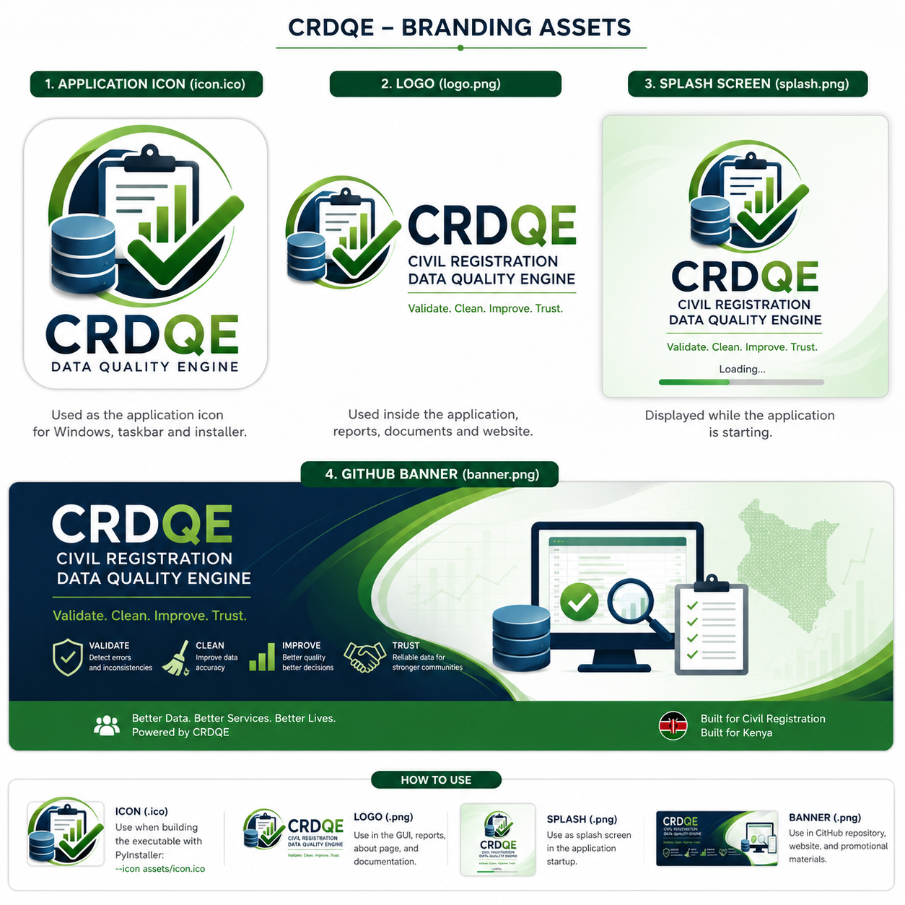
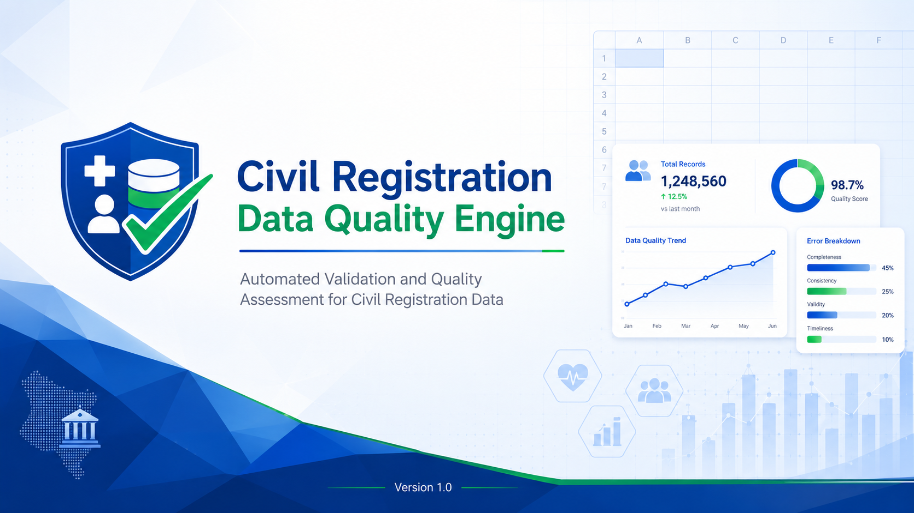
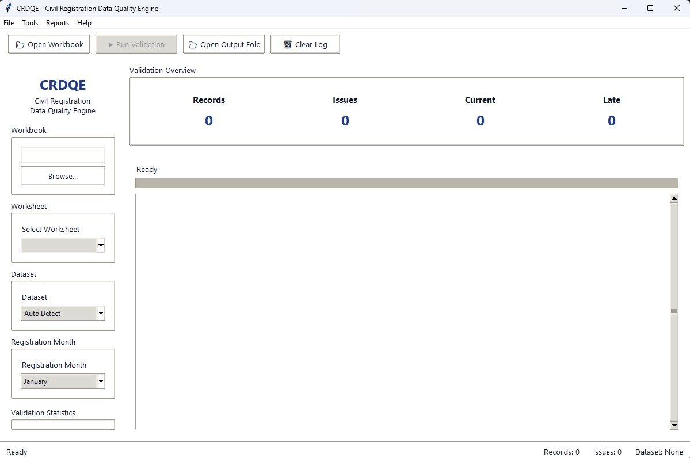

<p align="center">
    
</p>

<h1 align="center">
Civil Registration Data Quality Engine
</h1>

<p align="center">
Automated Birth & Death Registration Data Quality Validation
</p>

# Civil Registration Data Quality Engine (CRDQE)

> A professional desktop application for automated validation, cleaning, and quality assessment of Civil Registration and Vital Statistics (CRVS) data.

<p align="center">

</p>

---

## Overview

The **Civil Registration Data Quality Engine (CRDQE)** is a desktop application developed to automate the validation and quality assessment of Civil Registration datasets such as **Birth** and **Death** records.

Traditional validation of CRVS datasets is often manual, repetitive, and prone to human error. CRDQE provides an intelligent rule-based validation engine capable of automatically identifying inconsistencies, missing information, invalid values, duplicate records, and formatting errors while generating comprehensive quality reports.

The application is designed for government agencies, health departments, statistical offices, and organizations responsible for managing civil registration data.

---

# Key Features

### Intelligent Dataset Detection

Automatically detects whether the uploaded workbook contains:

- Birth Registration Data
- Death Registration Data

No manual configuration required.

---

### Smart Column Mapping

CRDQE automatically maps spreadsheet columns to standardized fields using:

- Exact Matching
- Fuzzy Matching
- Value-based Detection
- Placeholder Replacement

This allows the application to work with spreadsheets that contain inconsistent column names.

---

### Rule-Based Validation Engine

The validation engine performs hundreds of automated checks including:

- Missing values
- Invalid dates
- Invalid age ranges
- Duplicate entries
- Invalid categorical values
- Registration inconsistencies
- Logical data conflicts
- Mandatory field validation
- Formatting validation

Every issue is recorded with detailed information for later review.

---

### Worksheet Selection

Supports multi-sheet Excel workbooks.

Users can choose which worksheet to validate without modifying the original workbook.

---

### Registration Month Selection

Allows validation using the selected registration month for month-specific rules and reporting.

---

### Automatic Report Generation

After validation the application automatically generates:

- Validation Summary
- Flagged Records
- Quality Statistics
- Validation Logs

Reports are organized into dedicated output folders.

---

### Professional Desktop Interface

Built using Tkinter with a modular architecture featuring:

- Toolbar
- Sidebar
- Status Bar
- Logging Console
- Dialog Manager
- Modular Widgets

The interface is designed for simplicity while remaining scalable for future enhancements.

---

# Project Structure

```
CRDQE/
│
├── config/
│   ├── settings.yaml
│   └── schemas/
│
├── data/
│   ├── input/
│   ├── output/
│   │   ├── cleaned/
│   │   ├── flags/
│   │   ├── summaries/
│   │   └── logs/
│
├── crdqe/
│   ├── engine/
│   ├── gui/
│   ├── validation/
│   ├── reporting/
│   ├── io/
│   ├── utils/
│   └── core/
│
├── run_gui.py
├── requirements.txt
└── README.md
```

---

# Technologies Used

- Python 3.13
- Pandas
- OpenPyXL
- RapidFuzz
- Tkinter (GUI)
- YAML Configuration
- Logging
- Threading

---

# Validation Workflow

```
Load Workbook
        │
        ▼
Detect Dataset
        │
        ▼
Map Columns
        │
        ▼
Load Validation Rules
        │
        ▼
Run Rule Engine
        │
        ▼
Generate Reports
        │
        ▼
Display Validation Summary
```

---

# Installation

Clone the repository

```bash
git clone https://github.com/yourusername/CRDQE.git
```

Move into the project directory

```bash
cd CRDQE
```

Create a virtual environment

```bash
python -m venv .venv
```

Activate it

Windows

```bash
.venv\Scripts\activate
```

Install dependencies

```bash
pip install -r requirements.txt
```

Run the application

```bash
python run_gui.py
```

---

# Usage

1. Launch the application.
2. Browse and select an Excel workbook.
3. Choose the worksheet to validate.
4. Select the registration month.
5. Start validation.
6. Review generated reports inside the output folder.

---

# Reports Generated

The application produces:

- Validation Summary
- Flagged Records
- Cleaned Dataset
- Validation Logs
- Quality Statistics

These reports assist analysts in identifying and correcting data quality issues efficiently.

---

# Design Principles

CRDQE was developed following modern software engineering practices including:

- Modular Architecture
- Separation of Concerns
- Object-Oriented Design
- Configuration-Driven Rules
- Reusable Components
- Thread-Safe Processing
- Extensible Validation Framework

---

# Future Enhancements

Planned improvements include:

- PDF Report Generation
- Interactive Dashboards
- Database Integration
- Batch Workbook Processing
- User-defined Validation Rules
- Export to CSV and PDF
- Automated Data Cleaning Suggestions
- Statistical Quality Indicators
- Machine Learning Assisted Anomaly Detection

---

# Contributing

Contributions are welcome.

If you would like to improve CRDQE:

1. Fork the repository.
2. Create a feature branch.
3. Commit your changes.
4. Open a Pull Request.

---

# License

This project is licensed under the MIT License.

---

# Author

**Benard Mandera**

Bachelor of Science in Data Science

The Cooperative University of Kenya

GitHub: https://github.com/Bennyaks

---

## Acknowledgements

This project was developed to improve the efficiency, consistency, and reliability of Civil Registration and Vital Statistics (CRVS) data validation. It demonstrates the application of software engineering, data quality management, and automation techniques to solve real-world administrative data challenges.
